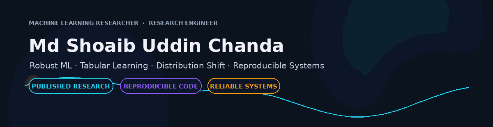

 

  

Research at a glance

<table>
<tr>
<td align="center" width="20%">
<h3>01</h3>
<b>Published paper</b> 
Array · Elsevier · 2026
</td>
<td align="center" width="20%">
<h3>03</h3>
<b>Research manuscripts</b> 
published + under review
</td>
<td align="center" width="20%">
<h3>19,890</h3>
<b>Evaluations</b> 
published HyperFast study
</td>
<td align="center" width="20%">
<h3>538,972</h3>
<b>Records</b> 
AutoFE confirmatory scope
</td>
<td align="center" width="20%">
<h3>14</h3>
<b>Datasets</b> 
CCR 10 + 2 + 2 benchmark
</td>
</tr>
</table>

What I work on

I study what happens when the assumptions behind clean machine-learning benchmarks stop being true.

My research focuses on robust machine learning, tabular learning, distribution shift, calibration, class imbalance, and reproducible evaluation. I also build the research infrastructure needed to make experiments inspectable, repeatable, and useful outside a notebook.

Publications & manuscripts

<table>
<tr>
<td width="33%" valign="top">

01 · Published

Revisiting training-free tabular models: A robustness and efficiency study

Array · 31 (2026) · 101049

A systematic robustness and efficiency study of training-free tabular classification against classical and gradient-boosted baselines.

Study design

17 binary-classification datasets

15 random seeds

13 conditions per dataset

19,890 model evaluations

Gaussian feature noise

MCAR missingness

data-scarcity stress tests

runtime + accuracy analysis

Finding: classical and gradient-boosted baselines generally produced stronger accuracy–runtime trade-offs, while tuned HyperFast showed narrower advantages on some difficult and highly imbalanced settings.

Paper / DOI →

Reproducibility code →

</td>
<td width="33%" valign="top">

02 · Under review

When Labels Lie and Classes Skew: Robust Tabular Deep Learning via Confidence-Calibrated Reweighting

Neural Networks · manuscript under review

CCR targets the joint failure mode of class imbalance + asymmetric label noise.

It combines detached confidence-aware sample reweighting with batch-normalized weights to separate robustness from optimization-scale effects.

Research evidence

structured 10 + 2 + 2 benchmark

14 datasets

9 loss baselines

XGBoost / LightGBM / CatBoost comparisons

gradient attribution

ablation studies

optimizer + architecture transfer

Repository results report stronger minority-recall retention under severe asymmetric corruption together with lower corrupted-sample gradient mass and reduced gradient-norm volatility.

Research code →

</td>
<td width="33%" valign="top">

03 · Under review

When More Features Hurt: Feature-Synthesis Variance Amplification in Automated Feature Engineering

Knowledge-Based Systems · manuscript under review

The paper studies whether automated arithmetic feature synthesis improves robust generalization—or amplifies perturbations, redundancy, estimator variance, and computational cost.

It formulates this mechanism as Feature-Synthesis Variance Amplification (FSVA).

Configured benchmark

25 OpenML datasets

5 seeds × 5 folds

14 training-data conditions

7 pipelines

10 classifiers

Confirmatory evidence

22 substantially completed datasets

538,972 evaluation records

Within that scope, unrestricted synthesis did not improve generalization; constrained addition/subtraction synthesis remained much closer to capped raw-feature baselines. The manuscript explicitly does not claim that AutoFE is universally harmful.

Research code →

Manuscript source →

</td>
</tr>
</table>

The research thread

<table>
<tr>
<td width="25%" valign="top" align="center">

Robustness

What survives when data is noisy, incomplete, scarce, shifted, or imbalanced?

</td>
<td width="25%" valign="top" align="center">

Reliability

What does an aggregate metric hide about minority classes, calibration, and failure modes?

</td>
<td width="25%" valign="top" align="center">

Evaluation

Can the experiment separate mechanism from benchmark noise and leakage?

</td>
<td width="25%" valign="top" align="center">

Reproducibility

Can another researcher inspect the assumptions, code, configuration, and evidence?

</td>
</tr>
</table>

Additional research

<table>
<tr>
<td width="50%" valign="top">

🎯 Calibration Collapse Under Class Imbalance

A research framework studying how resampling and post-hoc calibration affect minority-class probability reliability.

The project emphasizes:

per-class ECE rather than only global ECE

calibration–recall trade-offs

resampling/calibration interactions

controlled synthetic severity sweeps

leakage-aware preprocessing and experiment tracking

Explore Calibration Collapse →

</td>
<td width="50%" valign="top">

🔬 One research direction, different failure modes

HyperFast asks whether training-free performance survives degraded data and runtime constraints.

CCR asks what happens when imbalance and asymmetric label noise compound.

FSVA / AutoFE-ShiftBench asks whether aggressive feature synthesis improves or destabilizes generalization.

Calibration Collapse asks whether global calibration metrics hide minority-class failure.

The common theme is reliable empirical ML evaluation.

</td>
</tr>
</table>

Research engineering

<table>
<tr>
<td width="50%" valign="top">

🧬 AutoPrepML

ML data-readiness framework

A released Python framework for validated, reproducible ML-ready transformations.

Core engineering

train-only fitted preprocessing

data contracts

schema validation

fingerprints

transformation lineage

serializable artifacts

CLI workflows

storage and tracking integrations

cross-platform CI

Repository →

</td>
<td width="50%" valign="top">

🚘 SentinelTrack

Multi-camera vehicle intelligence & ANPR

A production-oriented computer-vision system connecting stream ingestion to spatio-temporal route reasoning.

Pipeline

RTSP/HLS → YOLO detection → ByteTrack → plate detection → OCR → target matching → PostGIS route reconstruction

Repository →

</td>
</tr>
<tr>
<td width="50%" valign="top">

🛡️ ZombieGuard

Defensive ZIP structural-evasion scanner

A bounded archive parser plus LightGBM model for contradictions between ZIP local headers, central-directory metadata, and payload structure.

Includes

nested evaluation

confidence intervals

model card

data card

integrity metadata

explicit limitations

CI / reproducibility checks

Repository →

</td>
<td width="50%" valign="top">

⚙️ Nexus AutoML Platform

Full-stack reproducible ML experimentation workspace

A secure tabular-classification platform with immutable dataset versions, background workers, experiment artifacts, ownership boundaries, and a typed frontend.

Stack

FastAPI · PostgreSQL · Redis · Celery · React · TypeScript · Docker

Repository →

</td>
</tr>
</table>

Research console

Technical toolkit

Experience

<table>
<tr>
<td width="50%" valign="top">

🇲🇾 AI & Software Engineering Intern

Delloyd R&D · Malaysia
Sep 2025 – Mar 2026

Computer vision, ANPR/OCR workflows, synthetic-data generation, and GPU-oriented model engineering.

</td>
<td width="50%" valign="top">

🏛️ Research & Data Analysis Intern

Hyderabad City Security Council / Hyderabad City Police project
Apr 2026 – May 2026

Operational analytics, data-driven reporting, workflow documentation, and process evaluation in a public-safety context.

</td>
</tr>
<tr>
<td width="50%" valign="top">

👨‍🏫 Technical Head

ACM Student Chapter · 2024 – 2026

Technical workshops, student mentoring, project guidance, and open-source / AI community activities.

</td>
<td width="50%" valign="top">

🤖 AI / Machine Learning Intern

RAM INFOTECH · 2023

Machine-learning and computer-vision work involving XGBoost, automated feature engineering, and facial-expression/stress-related workflows.

</td>
</tr>
</table>

How the work connects

flowchart LR
    A["Robust ML Question"] --> B["Controlled Experiment"]
    B --> C["Stress / Shift / Imbalance"]
    C --> D["Statistical & Mechanistic Evidence"]
    D --> E["Reproducible Research Artifact"]
    E --> F["Research Engineering"]
    F --> G["Reliable ML System"]

    P["Published HyperFast Study"] --> D
    Q["CCR"] --> C
    R["FSVA / AutoFE"] --> C
    S["Calibration Collapse"] --> C
    T["AutoPrepML"] --> F
    U["SentinelTrack"] --> G

Current direction

<table>
<tr>
<td width="33%" valign="top" align="center">

🔬 Research

Robust machine learning
Tabular learning
Distribution shift
Calibration
Empirical evaluation

</td>
<td width="33%" valign="top" align="center">

⚙️ Engineering

Research infrastructure
ML systems
Computer vision
MLOps
Reproducible tooling

</td>
<td width="33%" valign="top" align="center">

🤝 Open to

Master's research
Research assistant roles
Robust-ML collaborations
Reproducibility work
Research engineering

</td>
</tr>
</table>

Connect

  

Building reliable ML systems. Testing the assumptions benchmarks usually leave untouched.

